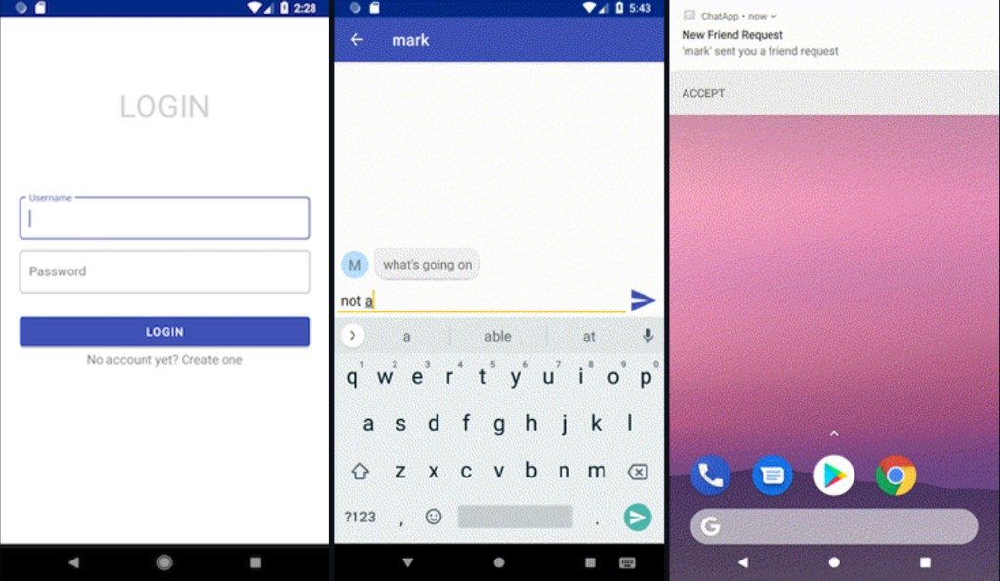
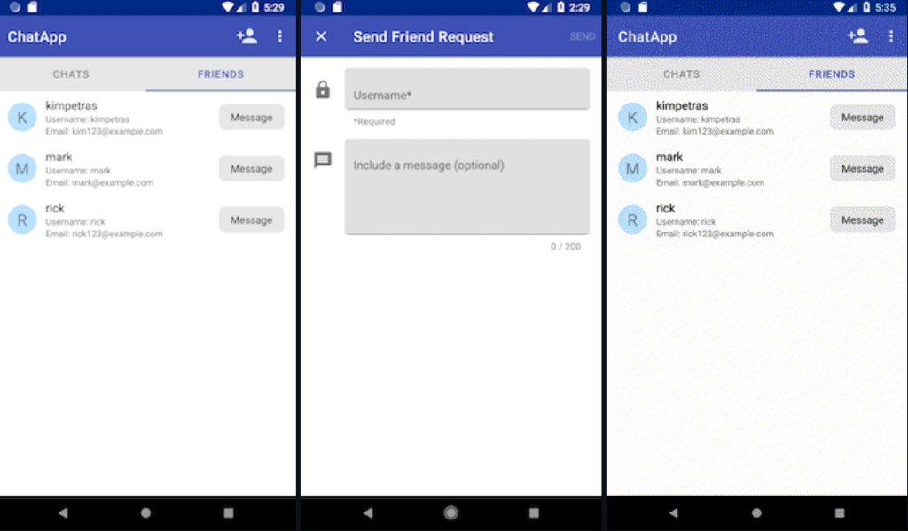

# ChatApp
Android realtime messaging app written in Kotlin that features user login/registration and the ability to add friends. Realtime messaging utilizes a WebSocket when app is in the foreground and Firebase Cloud Messaging when in the background.

### Built With
Written with Clean Architecture in mind and Single Activity Architecture, as well as MVVM for the presentation layer. Main libraries used were:
* [Tinder/Scarlet](https://github.com/Tinder/Scarlet): A Retrofit inspired WebSocket client for Kotlin, Java, and Android
* [Firebase Cloud Messaging](https://firebase.google.com/docs/cloud-messaging/): A cross-platform messaging solution that lets you reliably deliver messages at no cost
* [Room Persistence Library](https://developer.android.com/topic/libraries/architecture/room): An abstraction layer over SQLite to allow for more robust database access
* [Navigation Component](https://developer.android.com/jetpack/androidx/releases/navigation): A framework for navigating between 'destinations' within an Android application
* [Retrofit](https://square.github.io/retrofit/): A type-safe HTTP client for Android and Java
* [RxJava](https://github.com/ReactiveX/RxJava): Reactive Extensions for the JVM
* [Dagger2](https://github.com/google/dagger): A fast dependency injector for Android and Java

Testing libraries include:
* [Mockito](https://site.mockito.org/): Mocking framework for unit tests in Java
* [Roboelectric](http://robolectric.org/): Brings fast and reliable unit tests to Android
* [Espresso](https://developer.android.com/training/testing/espresso): Write concise, beautiful, and reliable UI tests.

### Features
* Login and registration
* Friends list and sending friend requests
* Realtime chat (WebSocket in foreground) and push notifications (FCM), including friend-request alerts

### Screenshots

  
  

